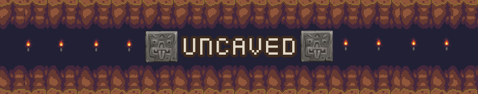
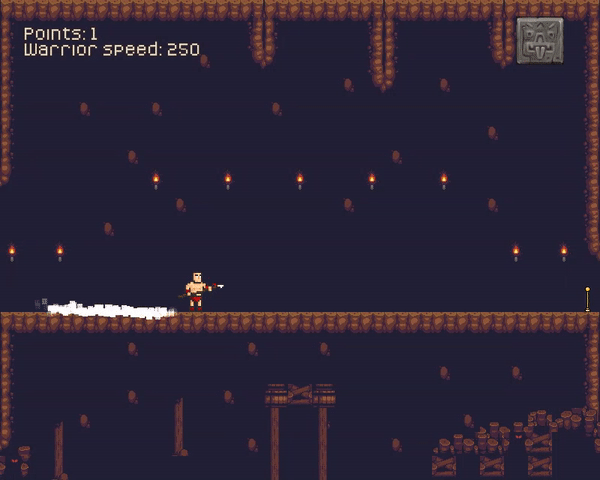

This is my game jam entry for the 48 hour GMTK game jam in 2023 (see [here](https://itch.io/jam/gmtk-2023)). The game is written in Java with libGDX (first time!) and is playable on itch.io [here](https://richardbaltrusch.itch.io/uncaved).



## Getting started

The game requires at least Java 1.8 to run or build and needs to be run from within the assets folder (read the official documentation [here](https://libgdx.com/wiki/start/import-and-running) for more information).

### Package as Executable

1) Download packr from https://github.com/libgdx/packr
1) Download OpenJDK JRE zip to be bundled with the game and place it in the repository root directory
1) Run packr from the repository root directory:

```
java -jar packr-all-4.0.0.jar  --jdk OpenJDK17U-jre_x64_windows_hotspot_17.0.7_7.zip --useZgcIfSupportedOs --executable uncaved --classpath=desktop/build/libs/desktop-1.0.jar --mainclass com.mygdx.game.DesktopLauncher --vmargs Xmx1G --output build --platform windows64
```

## License

The code for this game is licensed under the [MIT license](LICENSE). The visual assets and sound effects for this game use various licenses that permit free use (check [here](assets/attribution.txt) for details). The [music](assets/Atmospheric%20study%20combined.mp3) is not open source.
